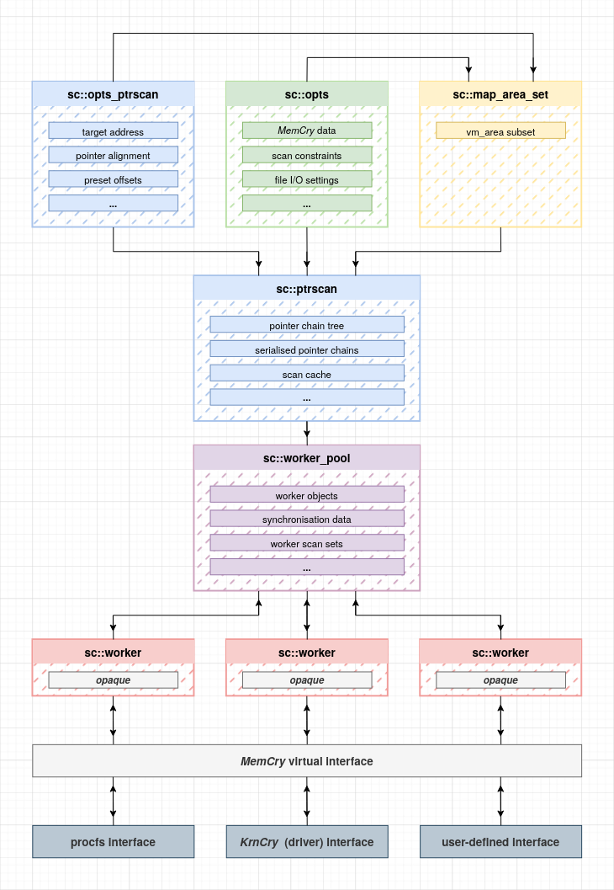

# ScanCry

### ABOUT:

*libscanmem* is the only project that implements comprehensive memory scanning on Linux. It suffers from a number of problems:

- It naively reads procfs mappings into a flat vector of `vm_area` structures. This makes it difficult to reason about objects rather than areas.
- Changes in the target's memory mappings invalidate all area pointers. Keeping track of individual areas is O(n^2), objects likely even worse.
- It naively opens file descriptors on the target.
- It naively attaches through ptrace, stopping the target in the process. This is particularly egregious.

 

*ScanCry* addresses all of these problems:

- Target memory mappings are organised into objects with corresponding areas using the *MemCry* library. No pointer invalidation occurs on update.
- Scans are performed through virtual hotswappable interfaces provided by *MemCry*. Switching scans from using procfs to using a kernel driver is trivial.
- **ScanCry is fundamentally built to avoid anticheat**.

 

Besides addressing *libscanmem*'s shortcomings, *ScanCry*'s core comes with new features:

- All scans are performed through a single scanning core that manages multithreading for you. Scan types only define a callback to process a single scanned address.
- Sophisticated filtering of the scan surface is made possible with *constraints*, which can be combined.  Examples of constraints include:
  - Omit or exclusively scan given areas and objects.
  - Only scan areas with given access permissions (e.g.: `rw-`)
- A **pointer scanner** is implemented as a scan type, with support for extensive configuration for all scenarios.

 

*ScanCry* is still in development. Currently only the pointer scanner is implemented. Soon, a value scan and pattern scan will follow. Commandline utilities will soon be written too.

    

### DEPENDENCIES:

If you're not using a packaged release, you'll need to install:

- [CMore](https://github.com/vykt/cmore) - Data structures for C.
- [MemCry](https://github.com/vykt/memcry) - Memory manipulation library.

### EXAMPLE:

*WIP*.
